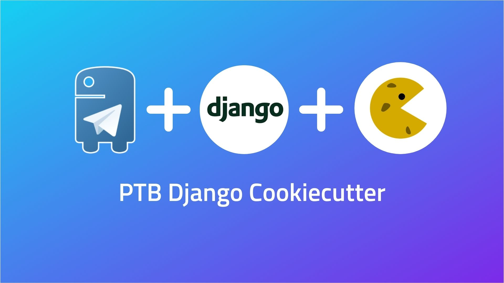
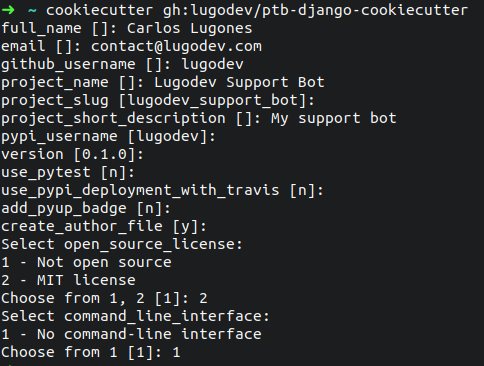

# PTB Django cookiecutter



> A simple cookiecutter to create Python Telegram bots, wrapped with Django.

[](https://github.com/lugodev/ptb-django-cookiecutter/releases)
[](https://ptb-django-cookiecutter.readthedocs.io/en/latest/?badge=latest)
[](https://t.me/LugodevChat)

<!-- ALL-CONTRIBUTORS-BADGE:START - Do not remove or modify this section -->
[](#contributors)
<!-- ALL-CONTRIBUTORS-BADGE:END -->

## Based on this cool projects

* [python-telegram-bot (PTB)](https://python-telegram-bot.org)
* [Django](https://djangoproject.com)
* [Cookiecutter](https://cookiecutter.readthedocs.io)

## What's inside

* Django app with `dev` and `prod` environments.
* Model to store bot users data.
* Command to run the bot.
* Admin web interface to see the bot data.
* Authentication mechanism.
* Some example callbacks.
* Small engine to wrap the bot callbacks.
* Ready for deployment using Docker via `docker-compose`.

## Quickstart

Install the latest Cookiecutter if you haven't installed it yet:

    pip install -U cookiecutter

Create your bot using this cookiecutter:

    cookiecutter gh:lugodev/ptb-django-cookiecutter

This will clone the cookiecutter and launch a wizard to help you customize your new bot.



## Bot engine folder structure 🤖

Once you have generated your new bot, you will get this folders structure:

* `src/bot`: The bot source code.
    * `core`:
        * `authentication.py`: The authentication mechanism.
        * `callbacks.py`: Your callbacks here.
        * `commands.py`: Your commands here.
        * `constants.py`: Your conversation states, defined as constants.
        * `conversation.py`: Your conversation callbacks.
        * `engine.py`: The bot engine.
        * `messages.py`: The message filter callbacks.
        * `models.py`: Your bot models, defined as Django model classes.
        * `renderers.py`: Methods to render your messages.

## Install your bot dependencies 📦

You have two primary options to install de bot Python dependencies: pip or Poetry. You can also use pipenv, virtualenvwrapper or another package managers. We recommend Poetry.

1. Install dependencies using [Poetry](https://python-poetry.org):

    ```
    curl -sSL https://raw.githubusercontent.com/python-poetry/poetry/master/get-poetry.py | python -
    cd src/bot
    poetry install
    ```

✨ **Tip (optional):** Create these aliases on on your `.bashrc` or `.zshrc`, like this

    ```
    alias poetry="python3 -m poetry"
    alias django="poetry run ./dev.py"
    alias djr="django runserver"
    alias djm="django makemigrations && django migrate"
    alias djmr="djm && djr"
    ```

1. Or install your dependencies using pip.

    ```
    pip3 install -r requirements.txt
    ```

## Initialize your bot environment variables

Place your env vars to the `.env` file (never push this file to the repo):

    SECRET_KEY=your django random secret key
    TELEGRAM_TOKEN=your bot token

## Migrate database

This cookiecutter uses the Django ORM. First you must to make the model's migrations and then migrate them to database:

    python3 src/bot/dev.py makemigrations
    python3 src/bot/dev.py migrate

## Start the bot

Start the bot (using the previously suggested alias, optional):

    django runbot

Or using Poetry:

    python3 -m poetry run src/bot/dev.py runbot

Or using Python:

    python3 src/bot/dev.py runbot

## Deploy your bot 🚀

Clone your repo to the server, and create this folder structure:

* `codebase`: The repo itself, the source code.
* `storage`: The place to store the DB and other persistant files.

Create and fill the `./codebase/.env` file with the environment vars.

Then, deploy, using `docker-compose`:

    cd codebase
    docker-compose up --build -d

## Bots created with this cookiecutter

None yet. Want to be the first? Submit your bot if it's open source.

## Related videos

[](https://www.youtube.com/watch?v=3mlE6QGyx78)

## Contributors ✨

Thanks goes to these wonderful people ([emoji key](https://allcontributors.org/docs/en/emoji-key)):

<!-- ALL-CONTRIBUTORS-LIST:START - Do not remove or modify this section -->
<!-- prettier-ignore-start -->
<!-- markdownlint-disable -->
<table>
  <tr>
    <td align="center"><a href="http://lugodev.com"><br /><sub><b>Carlos Lugones</b></sub></a></td>
    <td align="center"><a href="https://blog.ragnarok22.dev"><br /><sub><b>Reinier Hernández</b></sub></a></td>
  </tr>
</table>
<!-- markdownlint-restore -->
<!-- prettier-ignore-end -->

<!-- ALL-CONTRIBUTORS-LIST:END -->

This project follows the [all-contributors](https://github.com/all-contributors/all-contributors) specification. Contributions of any kind welcome!

<p align="center">
    
</p>
